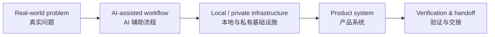

<h1 align="center">Hi, I'm Miao 👋</h1>

  <b>AI enthusiast · Practical systems builder · Local-agent workflow explorer</b>

  <b>AI 狂热追逐者 · 实用系统构建者 · 本地 Agent 工作流探索者</b>

---

## About Me

I am deeply fascinated by the current AI wave, but I care less about demos and more about **systems that actually work**.

我非常关注 AI 的快速演进，但我更关心的不是炫技 demo，而是 **真正能落地、能验证、能长期运行的系统**。

My current focus:

- Building practical AI workflows around local models, DGX, Mac mini, and agent tooling
- Turning messy real-world requirements into usable product systems
- Designing quality gates for AI-generated work, so AI agents stop shipping half-finished features
- Exploring domain-specific audit systems for insurance, healthcare data, and structured knowledge bases

我现在主要关注：

- 本地模型、DGX、Mac mini 和 Agent 工具链
- 把真实复杂需求做成可用产品系统
- 给 AI 交付建立验收和监工机制，减少半成品和假功能
- 探索保险、医保数据、行业知识库等垂直领域的审计系统

---

## Current Direction

I am building an enterprise AI implementation framework that helps organizations turn business workflows into agent collaboration, knowledge systems, automation tools, and verification governance, so AI can evolve from isolated tools into sustainable productivity systems.

我致力于构建面向企业的 AI 落地体系，帮助组织将业务流程转化为智能体协作、知识库、自动化工具和验证治理机制，让 AI 从单点工具升级为可持续运行的生产力系统。

This is one of my current directions, alongside local AI infrastructure, AI delivery governance, and domain-specific audit systems.

这是我当前方向之一，同时我也在持续探索本地 AI 基础设施、AI 交付治理和行业审计系统。

---

## Current Projects

### Enterprise AI Implementation Framework

An open framework for turning business workflows into agent collaboration, knowledge systems, automation tools, and verification governance.

一个面向企业 AI 落地的开源实施框架，帮助把业务流程转化为智能体协作、知识库、自动化工具和验证治理机制。

It includes:

- AI readiness assessment
- workflow-to-agent mapping
- verification governance checklist
- implementation handoff template
- 90-day AI pilot playbook

---

### AI Delivery Warden

A local quality gate for AI-generated product and code deliveries.

一个本地运行的 **AI 交付监工工具**，用于检查 AI 的交付说明、交接内容和代码变更是否真的可验收。

It catches:

- fake UI / mock data risk
- missing verification evidence
- missing acceptance criteria
- unauthorized phasing
- weak handoffs
- missing rollback or scope notes

---

### HiMiao Hong Kong Insurance Audit Platform

A sanitized Hong Kong insurance product audit and presentation platform with a public site, admin workflow, and FastAPI backend.

一个已清理敏感信息的 **香港保险产品信息审计与展示平台**，包含公开前台、管理后台和 FastAPI 后端。

---

## What I Like Building

I like projects that combine:

- AI agents
- local LLMs
- product thinking
- data systems
- operational workflows
- verification and audit

我喜欢把 AI、产品、数据、流程和验证体系串起来，而不是只做一个看起来能跑的 demo。

---

## Principles

> No evidence, no delivery.

> 没有证据，不算交付。

I believe future AI systems need more than prompts. They need:

- context discipline
- verification evidence
- rollback plans
- handoff quality
- human-readable operating rules
- practical workflows that survive real use

我相信未来真正有用的 AI 系统，不只靠提示词，还需要上下文纪律、验证证据、回滚方案、交接质量和可持续运行的工作流。

---

## Tech Interests

---

## GitHub Activity

  
  
  
  

---

## Open Source Direction

I am slowly building a personal open-source shelf around:

- enterprise AI implementation frameworks
- AI delivery governance
- local AI infrastructure
- domain-specific audit systems
- practical agent workflows
- bilingual open-source documentation

我正在慢慢搭建自己的开源作品架：企业 AI 落地框架、AI 交付治理、本地 AI 基础设施、行业审计系统、实用 Agent 工作流，以及中英文开源文档。
